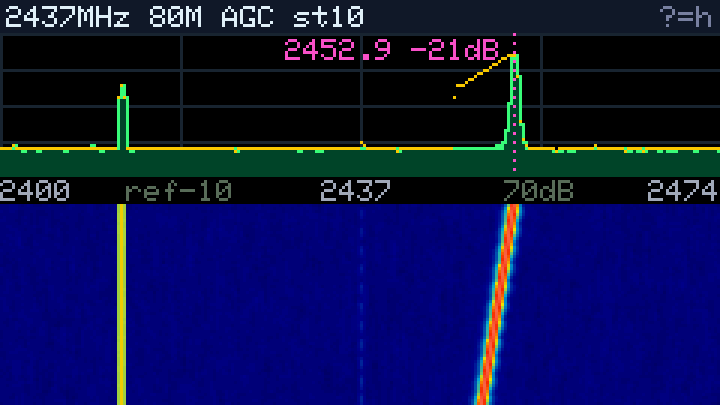
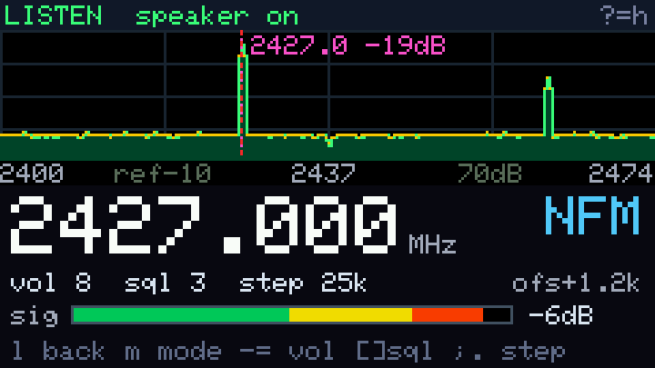
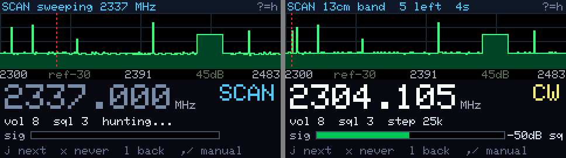

# CardputerADV-SDR

esp-sdr ported to the **M5Stack Cardputer ADV**: the ESP32-S3's own Wi-Fi
radio becomes a pocket software-defined radio with a spectrum and waterfall on
the Cardputer's screen, keyboard control, and audio out of its speaker.





This is a downstream of [ESPARGOS/esp-sdr](https://github.com/ESPARGOS/esp-sdr)
(GPL-3.0), which found the undocumented debug path that exposes raw I/Q
samples from ESP32 receivers. All upstream targets and host tools still build
from this tree; the Cardputer work lives in `main/boards/cardputer/` and the
`cardputer-adv` build profile. The upstream README is kept as
[UPSTREAM-README.md](UPSTREAM-README.md).

**Also on the LilyGO T-Dongle S3** (`tdongle-s3` profile,
`main/boards/tdongle/`): spectrum + waterfall with tap-to-zoom, a Wi-Fi
channel airtime survey and a transmitter-hunting meter, all driven by its
single button, with the RGB LED glowing by signal strength. See
[docs/tdongle-s3.md](docs/tdongle-s3.md). The FFT and drawing code both boards
share lives in `main/boards/common/`.

## What it does

- **Spectrum + waterfall** at 80, 40 or 16 MHz span, 100–6000 MHz tuning
  (the radio is happiest around 2.4 GHz), marker, peak hold, averaging.
- **Listen mode** (`l`): continuous NFM, AM, WFM or CW demodulation into the
  speaker with 1 kHz tuning steps, noise squelch, volume, signal bar and FM
  carrier offset readout.
- **Scanner** (`j`): sweeps 2300-2483.5 MHz (13 cm ham band and 2.4 GHz ISM),
  picks a random busy narrowband signal, centres it, and plays it, switching
  to CW for Morse beacons and skipping dead carriers. Keep pressing `j` to
  hop. HF Morse and number stations are out of this radio's range.
- **Sniffer tone** (`n`): a beep whose pitch rises with the strongest signal,
  handy for hunting a transmitter.
- **USB host tools keep working**: the esp-sdr browser viewer and bridge take
  over whenever a host sends commands.

## Install with M5Launcher

1. Copy `esp-sdr-cardputer-adv.bin` (from the Releases page or your own build)
   to the SD card.
2. In M5Launcher, open the SD menu and install it.

Use the merged `esp-sdr-cardputer-adv.bin`: it carries the bootloader and
partition table. The app-only image crashes when installed on its own.

Over USB, flash the same file at offset `0x0` with any esptool-based flasher.

## Build

ESP-IDF is pinned per profile in `firmware-targets.json`.

```sh
git submodule update --init --recursive
python tools/build_firmware.py --profile cardputer-adv --version local --output artifacts
```

Keys, screen layout, listen mode details and hardware notes:
[docs/cardputer-adv.md](docs/cardputer-adv.md). For the T-Dongle S3, build
`--profile tdongle-s3` and see [docs/tdongle-s3.md](docs/tdongle-s3.md).

## License

GPL-3.0, as upstream. See [LICENSE](LICENSE).
