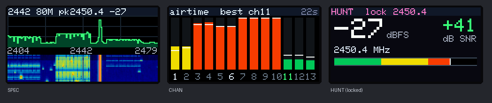

# LilyGO T-Dongle S3

The `tdongle-s3` firmware is the standard ESP32-S3 burst firmware plus a
standalone receiver on the T-Dongle S3's 0.96" 160×80 screen. The dongle has
one button (BOOT) and an RGB LED, so the UI is built around tap and hold
instead of keys. Plugged into a computer it still answers the normal serial
protocol over native USB, so the browser viewer, `esp-sdr-bridge` and the S3
`IQS`/`SPEC` modes keep working.



**Preview:** built and checked in a host-side simulation of the UI only. It
has not run on a real T-Dongle S3 yet. The pinout, backlight polarity and
display orientation follow LilyGO's schematic and factory example and agree
with TFT_eSPI, Zephyr, ESPHome, CircuitPython, espp and Launcher.

## Install

- **USB:** flash `esp-sdr-tdongle-s3.bin` at offset `0x0` with any
  esptool-based flasher. To enter download mode, hold BOOT while plugging the
  dongle in.
- **Launcher:** Launcher has a T-Dongle S3 build (`lilygo-t-dongle-s3-tft`).
  Copy the merged `esp-sdr-tdongle-s3.bin` to the TF card and install it from
  the SD menu, as on the Cardputer. Use the merged image; the app-only image
  has no bootloader.

```sh
python tools/build_firmware.py --profile tdongle-s3 --version local --output artifacts
```

## One button

| Gesture | Action |
| --- | --- |
| Tap | The page's action (below) |
| Hold 0.5 s, release | Next page: SPEC → CHAN → HUNT |
| Hold 2 s, release | Turn the picture upside down |

While the button is held, the top line says what releasing will do. A help
screen shows for 3 s at boot (any press skips it), and each page shows its
tap hint for 3 s when you switch to it. Page, zoom and orientation persist in
NVS.

## Pages

**SPEC**: spectrum and waterfall. It opens on the whole 2.4 GHz band (2442
MHz, 80 MHz span). Each tap zooms onto the strongest signal: 80 → 40 → 16 MHz
span, then back to the whole band. The top line shows centre, span and the
peak's frequency and level. The peak is taken from the smoothed spectrum, so
a single Bluetooth hop does not steal the zoom.

**CHAN**: Wi-Fi airtime survey for channels 1–13. Every frame captures the
whole band. A channel counts as busy when the mean power over its central 16
MHz is 5 dB above the band's noise floor. Bars show the share of busy frames
since the last reset (green under 20 %, yellow under 50 %, red above), and
the white tick on each bar is the recent airtime. The quietest of channels 1,
6 and 11 is highlighted as **best**. The seconds counter is the survey time.
Tap resets the survey.

**HUNT**: a meter for finding a transmitter. It shows the strongest signal's
level in dBFS, its height above the noise floor (SNR), its frequency, and an
SNR bar with a decaying peak tick. Tap locks onto the current peak frequency
(±2 bins), so other signals can't take over the meter; tap again to unlock.
HUNT uses SPEC's zoom, so zoom in on SPEC first for a narrower view.

**LED**: the colour follows the strongest signal's SNR, from blue (quiet)
through green and yellow to red (above 40 dB). It glows dimly on SPEC and
CHAN and bright on HUNT, so you can point the dongle around without looking
at the screen. Purple means a USB host is in control.

## With a host attached

As on the Cardputer, the display runs only between serial commands. When a
host sends a command it takes the serial lease, the screen reads **USB host
in control** and the LED turns purple. The display resumes five seconds after
the host goes quiet. The waterfall borrows ring bank 0, so it restarts after
a host session.

The QWIIC connector is UART0 (TX 43, RX 44) and carries the same protocol at
2 Mbaud, so another microcontroller can drive the radio over a 4-pin cable.

## Hardware notes

| Function | Pins |
| --- | --- |
| ST7735 160×80 LCD (SPI2, 40 MHz) | MOSI 3, SCLK 5, CS 4, DC 2, RST 1, backlight 38 (active low) |
| BOOT button | 0 (active low; held at power-up enters download mode) |
| APA102 RGB LED (bit-banged) | data 40, clock 39 |
| TF card (SDMMC, reserved) | CLK 12, CMD 16, D0 14, D1 17, D2 21, D3 18 |
| QWIIC / UART0 | TX 43, RX 44 |

The panel is driven in landscape with MADCTL `0xA8` (`0x68` flipped), a
window offset of (1, 26) inside the controller's 132×162 RAM, BGR order and
inversion on, matching LilyGO's factory example. The board pins are reserved
before GPIO discovery, so `GPIO?` does not offer them to a host. The SPI
interrupt handler runs from flash so DRAM stays below the S3 RF ring
(`sram_guard.ld`).

The T-Dongle S3 Plus (8 MB PSRAM, IR, microphone) uses the same screen,
button and LED pins, so this image should run on it too. Its extra parts are
unused.
